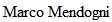

![\[AIB\]](/aib/wi/aibv72.gif){align="LEFT" height="72" width="71"}
** AIB. Pubblicazioni. DBBI20**\

::: {align="CENTER"}
[AIB-WEB](/) \| [Pubblicazioni AIB](/pubblicazioni/) \| [DBBI20 Indice
delle voci](dbbi20.htm)
:::

------------------------------------------------------------------------

### Dizionario bio-bibliografico dei bibliotecari italiani del XX secolo {#dizionario-bio-bibliografico-dei-bibliotecari-italiani-del-xx-secolo align="CENTER"}

![\[Ritratto\]](mendogni.jpg){height="250"}

## Mendogni, Antonio

(Parma 27 aprile 1910 -- Bologna 8 aprile 1997)

Giovanissimo, entrò come fattorino alla Biblioteca Palatina di Parma
nell\'agosto 1926, affiancando al lavoro gli studi superiori da
privatista e la frequentazione di un *atelier* di pittura. Nel gennaio
1929 partì volontario per il servizio militare in Cirenaica, che
completò nel gennaio 1931.\
Rientrato in Palatina come avventizio nel novembre 1931, l\'anno
successivo espose vari suoi quadri alla Prima Mostra Artistica allestita
nel ridotto del Teatro Regio dal 14 al 28 febbraio (recensita sul
«Corriere emiliano» del 24 febbraio) e vinse il concorso per la carriera
esecutiva venendo destinato, dal 1º luglio 1932, alla Biblioteca
universitaria di Pisa, come aiutante. Inizia da questa data una lunga
carriera che lo porterà al pensionamento per anzianità, il 1º febbraio
1973, con la qualifica di dirigente generale.\
Da Pisa riuscì però a tornare al principio del 1934 a Parma, anche per
le pressioni della direzione della Palatina, dove il suo lavoro era
stato sempre molto apprezzato.\
Superato nel 1940 il concorso pubblico per la carriera di concetto,
venne nominato ordinatore dal 1º luglio, restando alla Biblioteca
Palatina, di cui teneva l\'economato, la segreteria e l\'amministrazione
oltre a curare, per una parte dell\'orario, la Sezione Musicale.\
Laureato in Materie letterarie il 23 maggio 1941 all\'Università di
Milano, già da gennaio era stato richiamato alle armi, con il grado di
tenente, e assegnato alla Divisione Legnano, che operò in Albania e in
Francia. Promosso capitano, l\'8 settembre 1943 fu colto in Abruzzo,
dove si diede alla macchia con l\'intenzione di passare il fronte per
ricongiungersi al ricostituito esercito italiano a fianco degli alleati.
Visti infruttuosi i suoi avventurosi tentativi e avuta conoscenza delle
precarie condizioni economiche della madre e del fratello invalido,
rientrò a Parma alla fine dell\'inverno 1944 per riprendere il lavoro in
Palatina. Dopo la fine del conflitto gli sarà conferita la croce di
guerra per il servizio prestato in zona d\'operazioni tra il 1940 e il
1943.\

Nel dopoguerra vinse il concorso di gruppo A e venne nominato
vicebibliotecario dal 1º luglio 1951, conseguendo poi le promozioni a
bibliotecario di 2ª (luglio 1952) e di 1ª classe (febbraio 1954).\
Quando già da alcuni anni svolgeva le funzioni di vicedirettore della
Biblioteca Palatina, il 1º agosto 1961 venne trasferito, a seguito di
promozione, alla Biblioteca universitaria di Pisa con l\'incarico della
direzione, che tenne solo fino al 30 settembre. Il 1º ottobre 1961,
infatti, fu nominato Soprintendente bibliografico per Bologna, la
Romagna e le Marche, con sede presso la Biblioteca universitaria di
Bologna.\
Con il passaggio delle Soprintendenze bibliografiche alle regioni (1º
aprile 1972) preferì rimanere nei ruoli dell\'amministrazione statale e,
dopo un periodo di assegnazione alla Biblioteca nazionale centrale di
Firenze, il 1º novembre 1972 assunse l\'incarico di direttore della
[Biblioteca Marucelliana](/aib/stor/teche/fi-mar.htm) di Firenze, che
mantenne fino al momento del pensionamento, il 1º febbraio 1973.\
Il 27 dicembre 1973 fu nominato Commendatore della Repubblica italiana.\
Sebbene colto e dotato di notevoli capacità di analisi e di linguaggio,
il temperamento e le circostanze lo indussero a privilegiare, rispetto
alle attività di studio erudito e di saggistica, quelle di
organizzazione delle strutture bibliotecarie, da migliorare sempre a
favore del pubblico, e di conservazione del patrimonio librario.\
Della sua lunga permanenza alla Biblioteca Palatina di Parma sono
particolarmente significativi il recupero, non esente da rischi, di
volumi e di interi fondi dalle macerie della biblioteca, bombardata nel
1944, e «da scaffali rimasti appesi a muri pericolanti» ed i conseguenti
lavori, da lui diretti, «di spostamento e riordino di raccolte librarie;
lavori, questi, resisi frequenti ed indispensabili dopo le distruzioni
belliche», come egli stesso scrisse; attività che continuarono almeno
fino al 1955. Va ricordato, inoltre, l\'allestimento, nei locali della
Palatina, della Mostra di codici miniati, edizioni principe, edizioni
bodoniane ed incisioni nel 1957 e della Mostra bodoniana nel 1958,
eventi ampiamente recensiti sulla «Gazzetta di Parma» (10 luglio 1957 e
18 novembre 1958).\
Nella sua più che decennale esperienza di Soprintendente provvide, nei
primi anni Sessanta, alla riorganizzazione del servizio di pubblica
lettura e di prestito librario della provincia di Ravenna, i cui volumi
dovettero, per un certo periodo, transitare nei nuovi e spaziosi locali
della Soprintendenza bibliografica, la cui sede fu da lui trasferita da
quella originale all\'interno della Biblioteca universitaria di Bologna,
divenuta angusta, nel pregevole edificio quattrocentesco di piazza
Minghetti 1, al centro della città.\
Nel 1962 partecipò a un viaggio di studio, ideato e gestito dal Comune
di Bologna, negli Stati Uniti e nel Nord Europa, finalizzato a conoscere
l\'organizzazione e le strutture bibliotecarie di quei paesi, in vista
della creazione del polo bibliotecario bolognese. Al viaggio
parteciparono Renato Zangheri, allora assessore alla cultura e
successivamente sindaco della città, e [Gino Nenzioni](nenzioni.htm),
direttore della Biblioteca comunale dell\'Archiginnasio.\
Dal novembre 1966 e per buona parte del 1967, pur trovandosi in una
situazione familiare estremamente difficile (era morta improvvisamente
la moglie quattro mesi prima ed era rimasto con un figlio neppure
adolescente), si adoperò con sagacia ed accanimento a salvare il
salvabile del patrimonio librario della Biblioteca nazionale centrale di
Firenze, colpita dall\'alluvione del 4 novembre 1966. Poiché la
Soprintendenza bibliografica della Toscana era parimenti annichilita né,
allora, esisteva la Protezione civile, si trattò, da più parti, di
inventare e rendere immediatamente operativa tutta la logistica
dell\'immane catena: dall\'organizzare il trasporto dei libri impastati
di fango putrido, allo studiare e sperimentare le tecniche che
permettessero dapprima di bloccarne il degrado e poi di recuperarne la
leggibilità. Chi ha vissuto quei momenti dal versante bolognese può
percepire distintamente ancora i fari sciabolanti nella notte di camion
sotto la neve sui passi dell\'Appennino; il calore di fornaci romagnole
e degli essiccatoi della Manifattura Tabacchi di Bologna, dove un numero
impressionante di libri, liberati dal grosso della mota e con fogli di
carta assorbente interposti pazientemente fra pagina e pagina, era posto
ad asciugare; il sudore degli impiegati della Soprintendenza tenaci ed
esausti; la trepidazione dei monaci dell\'Abbazia del Monte di Cesena,
curvi su pregevoli tomi sfigurati, non per miniarli, come i loro
medievali confratelli, ma per farne risorgere lo splendore.\
Nel primo anniversario del disastro, per il rilevante ruolo da lui
svolto, gli fu conferita dal ministro della pubblica istruzione, Luigi
Gui, una specifica attestazione corredata da medaglia d\'argento.\
Il 27 maggio 1969 fu nominato socio benemerito dell\'Accademia
scientifico letteraria degli Incamminati di Modigliana ed il 15 novembre
1973 socio benemerito della Società Torricelliana di scienze e lettere
di Faenza.\
Costantemente, durante il decennio da soprintendente, Mendogni si
adoperò per l\'istituzione di nuove biblioteche, quali le comunali di
Civitanova Marche, Porto San Giorgio, Pergola, Novafeltria, Fermignano,
Chiaravalle, Piandimeleto, e per il profondo rinnovamento di altre, fra
le quali quelle di Ascoli Piceno, Ostra, Sassoferrato, Senigallia,
Fermo, Jesi, Camerino, Cingoli, Macerata, Recanati, San Severino Marche,
Tolentino, Cupramontana, Fano, Fossombrone, Urbania, Pesaro
(Oliveriana).\
Prova significativa della sua azione sono le numerose lettere -
conservate dalla famiglia - inviategli da bibliotecari, sindaci ed
assessori della sua circoscrizione in occasione del trasferimento a
Firenze. Nella quasi totalità di esse appare, al di là delle frasi di
circostanza, un elevato apprezzamento per il lavoro svolto e, in non
poche, il timore per le probabili conseguenze della sua partenza.\
L\'attività erudita in senso stretto si è risolta nella partecipazione a
comitati d\'onore ed esecutivi di mostre artistiche e bibliografiche
(tra le quali la Mostra di Aldo Manuzio, Ancona 1962; Plantin-Rubens:
arte grafica e tipografia, Bologna 1965; L\'incisione europea dal XV al
XX secolo, Torino 1968) e congressi (come quello su \"Federico II\",
Jesi 1966, e \"Stendhal e Bologna\", Bologna 1972) e ad interventi in
convegni organizzati dalla Deputazione di storia patria delle Romagne,
da quella delle Marche e dall\'Associazione italiana biblioteche, della
quale fu socio al 1936 e poi dal 1964 al 1971 presidente del comitato
regionale della [Sezione di Bologna, Romagna e
Marche](/aib/stor/sezioni/romagna.htm).

Elisa Di Renzo. *Una biblioteca, un\'alluvione: il 4 novembre 1966 alla
Nazionale di Firenze: storia di un\'emergenza*. Roma: Associazione
italiana biblioteche, 2009, p. 199-200, 206.

*Gli archivi delle soprintendenze bibliografiche per l\'Emilia Romagna:
inventario*. Bologna: Compositori, 2010, all\'indice.

Andrea De Pasquale. *Antonio Mendogni*. In: *Dizionario biografico dei
soprintendenti bibliografici (1919-1972)*. Bologna: Bononia University
Press, 2011, p. 401-402.

\

------------------------------------------------------------------------

[Copyright AIB](/su-questo-sito/dichiarazione-di-copyright-aib-web/)
2011-01-06, ultimo aggiornamento 2020-05-09, a cura di [Simonetta
Buttò](/aib/redazione3.htm) e [Alberto
Petrucciani](/su-questo-sito/redazione-aib-web/)\
**URL:** https://www.aib.it/aib/editoria/dbbi20/mendogni.htm

------------------------------------------------------------------------

::: {align="CENTER"}
[AIB-WEB](/) \| [Pubblicazioni AIB](/pubblicazioni/) \| [DBBI20 Indice
delle voci](dbbi20.htm)
:::
